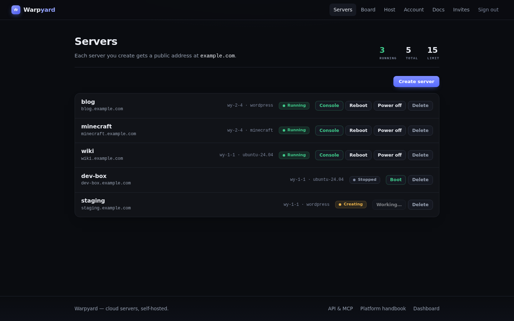
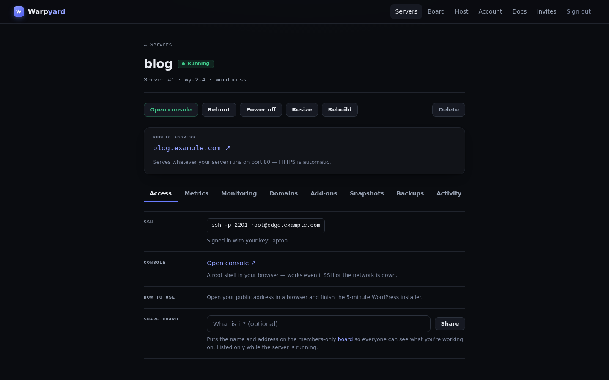
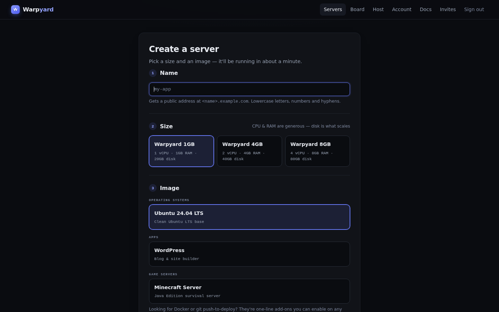

# Warpyard

**Run a tiny cloud provider on your own Proxmox box.**

Warpyard is a self-hosted VM-leasing platform — a "Linode + Netlify clone" for a
friends/community/club audience. Members sign in to a clean dashboard, click
**Create server**, and ~30 seconds later they have a VM with a public
`https://<name>.your-domain.com` address, SSH access, a browser console, snapshots,
backups, and metrics. You provide one Proxmox host and a $5 VPS; Warpyard provides
everything in between.



<p align="center">
  
  
</p>

## What members get

- **Servers in seconds** — cloud-init golden templates, ZFS linked clones, static IPAM
- **A public address out of the box** — `<name>.<your-domain>` HTTPS via the edge, plus
  custom domains with automatic certs
- **End-to-end TLS** (opt-in) — the VM terminates its own HTTPS; the edge forwards
  ciphertext by SNI and never sees plaintext
- **SSH + browser console** — per-server SSH port on the edge; noVNC console with
  serial auto-login (ownership-gated, one-time tickets)
- **Full lifecycle** — start/stop/reboot, rebuild, grow-only resize, snapshots,
  nightly off-host backups (Proxmox Backup Server), at-rest disk encryption (opt-in)
- **One-click apps** — WordPress, Nextcloud, Gitea, Vaultwarden, n8n, Jellyfin, Ghost,
  code-server, Uptime Kuma, Ollama+WebUI
- **Game servers** — LinuxGSM images (Minecraft, Factorio, …) with raw TCP/UDP
  forwards and live player counts
- **Push-to-deploy** — a `git push` image that builds and serves static/Node sites
- **Metrics + monitoring** — per-VM charts, a live host page, optional uptime
  monitoring with email alerts
- **Invites, quotas, share board** — invite-only membership, per-member resource
  quotas, an opt-in board of running community servers

## Drive it with an AI

The dashboard is one client of three. Warpyard ships a **REST API** (Bearer keys) and
a full **MCP server** (OAuth with PKCE + dynamic client registration) — add
`https://mcp.<your-domain>/mcp` to Claude, Cursor, or any MCP client and your AI can
provision, resize, snapshot, and manage servers directly.

## How it works

```
internet → edge VPS (Caddy: on-demand TLS / SNI passthrough / socat forwards)
         → WireGuard → your firewall → isolated tenant VLAN → tenant VMs
control plane VM (FastAPI + Postgres + worker + reconciler) → Proxmox API
```

Tenants live on an isolated VLAN with internet egress only (no LAN, no SMTP, no
firewall access), behind per-VM anti-spoof and default-deny inbound rules generated
from the same IPAM source of truth. The control plane holds four privilege-separated
Proxmox tokens scoped to the tenant pool, and keeps **no standing access** to tenant
VMs — they carry only their owner's SSH keys. The full threat model is in
[`docs/ARCHITECTURE.md`](docs/ARCHITECTURE.md).

## What this is (and isn't)

Built for **community scale**: one standalone tenant hypervisor, one small public edge
VPS, an invite-only membership you personally vouch for. No HA, no multi-node
scheduling, no metered billing (a Stripe-shaped `price_cents` exists on plans, but the
reference deployment runs free-for-friends). If you need a real cloud, buy one — this
is for running one.

**Fair warning:** setup is genuinely infrastructure work — Proxmox roles, a VLAN, a
WireGuard tunnel, DNS. It's a weekend project, not `docker compose up`. The payoff is
a platform your friends can actually use. Start with
[`docs/INSTALL.md`](docs/INSTALL.md).

## Dev quickstart

```bash
python3 -m venv .venv && . .venv/bin/activate
pip install -r requirements.txt -r requirements-dev.txt
cp .env.example .env                    # defaults are fine for local dev
docker compose -f docker-compose.dev.yml up -d postgres   # or keep sqlite
alembic upgrade head
python scripts/seed_dev.py ~/.ssh/id_ed25519.pub          # plans, images, admin user
uvicorn app.main:app --reload           # API + dashboard on :8000
python -m app.jobs.worker               # worker (separate shell)
pytest && ruff check . && ruff format --check .
```

The test suite (159 tests) is fully hermetic — no Proxmox, no network.

## Repo layout

```
app/
  main.py          FastAPI app + routers
  config.py        pydantic-settings — every deployment value, env-driven
  models.py        schema (users, plans, images, instances, IPAM, jobs, routes, …)
  states.py        instance state machine — single source of truth for transitions
  service.py       shared domain logic (web, REST and MCP all call through here)
  proxmox.py       Proxmox API client (privilege-split tokens)
  ipam.py          IP allocation + anti-spoof rule generation
  reconciler.py    desired-vs-actual drift detection/repair
  jobs/            Postgres-backed queue + worker + per-verb handlers
  routes/ web.py   REST API + server-rendered dashboard
  mcp_server.py    MCP server (OAuth-protected)
  templates/ static/  Jinja templates; all JS vendored (htmx, noVNC, idiomorph)
edge/              edge VPS: Caddyfile, route-sync agent, welcome page
deploy/            control-plane provisioning + golden-template build scripts
docs/              INSTALL, ARCHITECTURE, NETWORK, PVE-SETUP, VERBS, image guides
alembic/           migrations
```

## Documentation

| Doc | What it covers |
|---|---|
| [`docs/INSTALL.md`](docs/INSTALL.md) | **Start here** — full from-scratch deployment |
| [`docs/ARCHITECTURE.md`](docs/ARCHITECTURE.md) | components, security model, design principles |
| [`docs/PVE-SETUP.md`](docs/PVE-SETUP.md) | Proxmox pool, roles, tokens, templates |
| [`docs/NETWORK.md`](docs/NETWORK.md) | tenant VLAN, firewall rules, WireGuard, edge Caddy |
| [`docs/VERBS.md`](docs/VERBS.md) | instance state machine + job rules |
| [`docs/DEPLOY-IMAGE.md`](docs/DEPLOY-IMAGE.md) | the push-to-deploy image |
| [`docs/APP-IMAGES.md`](docs/APP-IMAGES.md) / [`docs/GAME-IMAGES.md`](docs/GAME-IMAGES.md) | building one-click app & game templates |

## License

[AGPL-3.0](LICENSE). Third-party vendored assets are listed in
[`THIRD-PARTY-NOTICES.md`](THIRD-PARTY-NOTICES.md).
